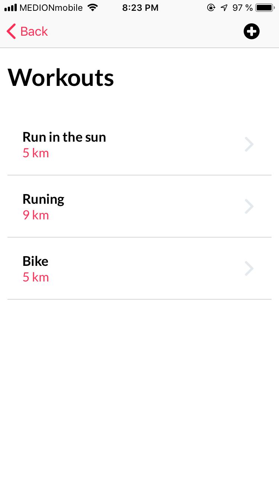
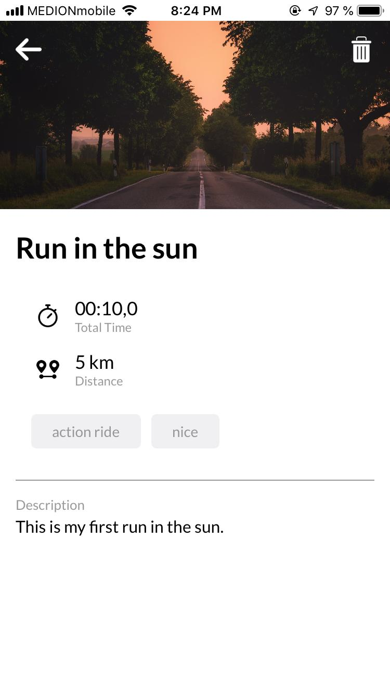
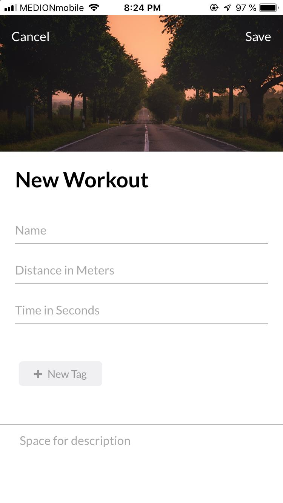

# Cross-platform Mobile App (Nativescript-Angular).

Front-End for cross-platform mobile app to manage workouts.

Implemented in Nativescript and Angular and talk to Graphql API to excute some Queries and Mutations.

What has been implemented in this project:
- User auth by execute graphql mutation.
- Retrieve all workouts in list view by execute graphql query.
- Add new workout by execute graphql mutation.
- Delete a wrkout by execute graphql mutation.
- Basic input validation.

# App screens

## 1- Login page

-------------------------------------------------
## 2- All workouts list page

-------------------------------------------------
## 3- Deatails of a workout page

-------------------------------------------------
## 4- Add new workout page

-------------------------------------------------

### *Note: the app will not run because the Graphql api was disabled.

